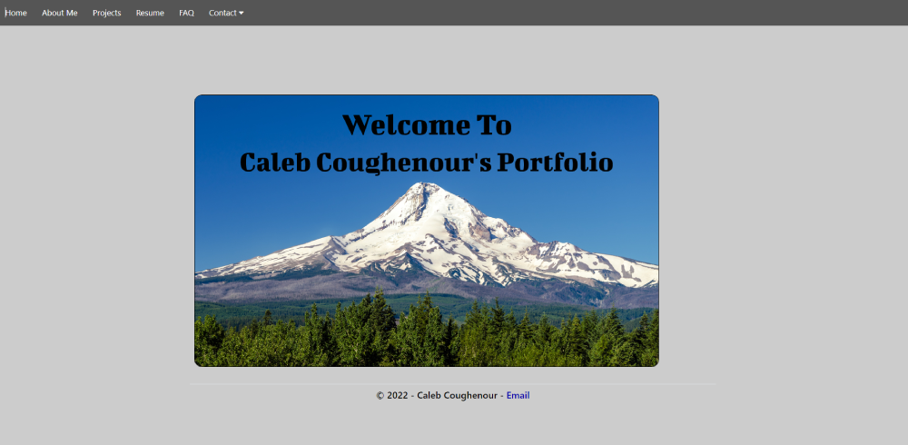

# Caleb Coughenour's Portfolio Page

  

 

 

## Hosting

 The site is hosted using Azure [Here](https://calebcoughenour.com)

## Description

 This is a MVC webpage that has an about me, my resume and displays four of my projects

 ## Required

* [REPL](https://dotnet.microsoft.com/en-us/download/dotnet/thank-you/sdk-5.0.401-windows-x64-installer) - restart terminal after install
* .NET (install using "dotnet tool install -g dotnet-script" in console)
    - Configure Bash environment variables by running "echo 'export PATH=$PATH:~/.dotnet/tools' >> ~/.bash_profile" in your gitbash terminal

## Setup/Installation

* Copy the git repository url from the "code" drop down on this github page
* Open a shell program & navigate to your desktop
* Clone the repository using the copied URL and the "git clone" command
* In the shell program, navigate to the root directory of the newly created file called "CalebCoughenour.Solution"
* Next, run the command "dotnet run" to start the program
* Open a web browser and plug "http://localhost:5000/" or "https://localhost:5001/" into the URL bar

## Known Bugs

* No known bugs

## License

[MIT](LICENSE)

Copyright (c) 7/8/22 Caleb Coughenour